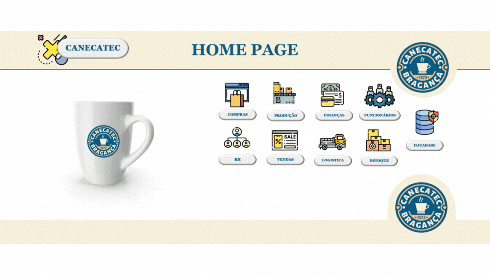
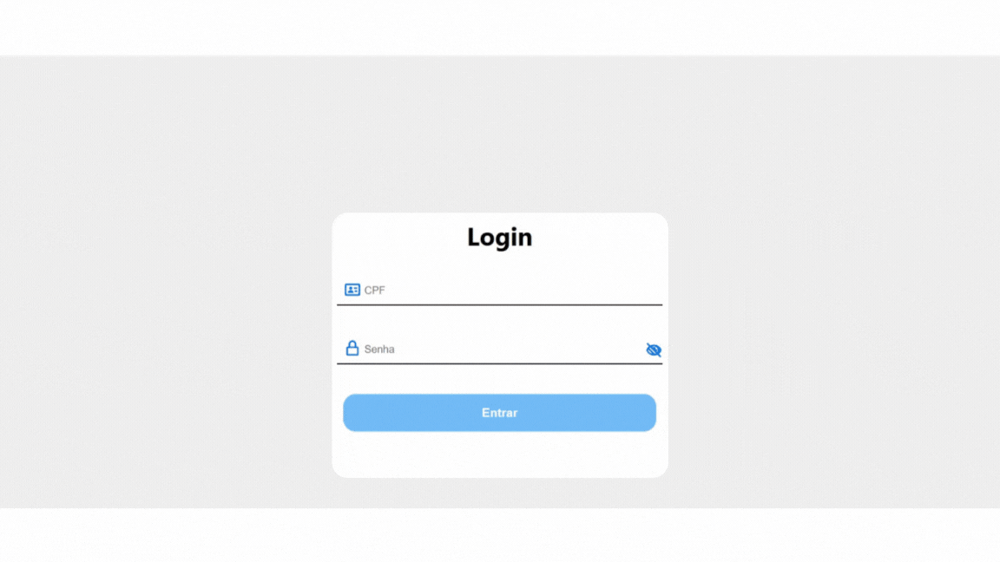

# Portfólio-Luiz-Henrique-Souza-Silva
 

  \<a href ="#introducao"> Introdução </a>  \
  <a href ="#contatos"> Contatos </a>  \ 
  <a href ="#1"> Canecatec </a>  \ 
  <a href ="#2"> Assistente Virtual </a>  \ 
  <a href ="#3"> Sistema Web DashBoard de Gerenciamento de Vendas Pro4Tech </a>  \ 
  <a href ="#4"> Sistema de Integração Logística para a JJM Log </a>  \
  <a href ="#5"> Sistema de Gerenciamento de Reembolsos para a GSW </a> \
  <a href="#6">Plataforma de Nutrição Personalizada com IA Generativa para a Xertica.ai</a>

<h2 align='center'>👨‍💻 Introdução 👨‍💻</h2>
   
  

    Meu nome É Luiz Henrique Souza Silva, tenho 21 anos e atualmente, sou estudante do 6º semestre do curso de Análise e Desenvolvimento de Sistemas na Fatec Prof. Jessen Vidal, em São José dos Campos. Meu interesse pela tecnologia foi na Etec-Atibaia quando iniciei o curso de Desenvolvimento de Sistemas em 2020.
    
Minha primeira interação com a área de programação foi na Etec Prof° Carmine Biagio Tundisi em 2020, quando desenvolvi as primeiras linhas de comando nas aulas. Com certeza no início foi difícil, porém com o tempo e com determinação fui conseguindo solucionar problemas através dos códigos, ali nas aulas de Técnica de Programação e Algoritmos pude ter o primeiro contato com a linguagem C#. Com o desenvolvimento do curso, fui me aprofundando com as aulas de Técnica de programação e algoritmos, design digital, Analise e projetos de sistemas, Fundamentos da informática, programação Web 1,2 e 3, Banco de dados 1 e 2, desenvolvimento de sistemas, programação de aplicativos mobile 1 e 2, sistemas embarcados, qualidade e teste de software, internet/protocolos e segurança de sistemas de informação e com isso me aprofundei em diversos projeto em HTML, CSS, banco de dados, C#, Java Script, MySql, Arduino entre outras tecnologias, como último projeto de TCC na Etec, eu juntamente com o meu grupo desenvolvemos um projeto com Arduino, criamos um sistemas de irrigação automatizada, este projeto foi extremamente desafiador e acredito que ali concretizei uma paixão maior por programação. Na conclusão do ensino médio, me inscrevi para a Fatec Jornalista Omair Fagundes em Bragança Paulista, na onde conclui o 1° semestre e me transferi para a Fatec Prof° Jessen Vidal em São José dos Campos, onde estou atualmente no 6° semestre.

Atualmente na área do desenvolvimento de software, estou interessado em ingressar no mercado de trabalho e adquirir e melhorar meus atuais conhecimentos, estou focado em aprimorar minhas habilidades no back-end e no front-end, sendo assim identificando pontos fracos e estudando cada vez mais. Além das Soft-Skills, essa trajetória tem me permitido desenvolver habilidades interpessoais importantes, como comunicação, trabalho em equipe e resolução de problemas, que são essenciais para uma carreira de sucesso na área de tecnologia. Estou me desenvolvendo e criando hábitos que me ajudem a crescer profissionalmente e pessoalmente e, assim conseguindo me tornar um profissional de excelência.

   

 

  
## Cursos

 |   Curso  |    Plataforma de Ensino    |
 | :------:      | :------: |
 | Introdução ao MongoDB | MongoDB |
 | Google Cloud Foundations | GoogleCloud |
 | Escola de Inovadores | Inova CPS|
 |Caminho do desenvolvedor MongoDB Python| MongoDB|
 |Perguntas práticas do desenvolvedor associado Python| MongoDB|

 

<h2 align='center'>📞 Contatos 📞</h2>

 

 

<h2 align='center'>💻 Meus Principais Conhecimentos 💻</h2>

 

## Projetos

# Em 2023-1 - ERP - Canecatec (1° Semestre)

### 📋 Desafio (Problema)

A Fatec simulou uma empresa fictícia de fabricação e venda de canecas, onde cada setor operava de forma isolada e dependente de planilhas manuais. A ausência de padronização entre compras, produção, vendas e estoque ocasionava divergências frequentes nos dados, retrabalho e dificuldade de rastrear informações críticas. Processos essenciais — como atualização de custos, registro de pedidos, cálculo de produção e controle de funcionários — eram executados manualmente, aumentando o risco de erros e reduzindo a eficiência operacional.
Essa realidade demandava uma solução que centralizasse os dados, eliminasse inconsistências e automatizasse rotinas repetitivas.

### 🧩 Solução Desenvolvida

Como **solução** a equipe desenvolveu um sistema desktop integrado no Excel, utilizando VBA e Macros para automatizar atividades manuais e padronizar o fluxo de informações. A solução reúne em um único ambiente os módulos de Compras, Produção, Vendas, RH e Estoque, automatizando cálculos, consolidando registros e reduzindo falhas operacionais.

Foram criadas rotinas automatizadas para controle de pedidos, geração de relatórios, cálculo de custos e atualização de dados produtivos. A interface organizada permitiu que cada setor registrasse suas atividades de maneira padronizada, garantindo mais confiabilidade, agilidade e rastreabilidade.
A solução deveria obrigatoriamente utilizar Excel, Macros e VBA.

> Acesse o repositório desse projeto clicando <a href="https://github.com/LuizHenrique435/ERP-Canecatec" target="_blank">aqui!</a>

### ⚒️ Tecnologias Utilizadas

  
    <b>VBA</b> - </img>
  
  
    Linguagem utilizada para criar automações, rotinas lógicas e funcionalidades dinâmicas do sistema.
  

 

  
    <b>Excel</b> - </img>
  
  
    Interface principal para desenvolvimento do sistema e estruturação dos módulos.
  

 

  
    <b>Hospedagem Local</b> - </img>
  
  
    Todo o sistema foi desenvolvido e executado localmente em estações internas.
  

 

---

### 💡Contribuições Pessoais

Participei como membro ativo do DevTeam, realizando estudos sobre materiais, processos produtivos, maquinário necessário e custos de produção das canecas. Após o levantamento de dados, apresentei análises que ajudaram a equipe a definir os modelos de canecas a serem fabricados (porcelana e acrílico), contribuindo diretamente para a construção das bases de custos e abastecimento do banco de dados.
  

Também fui responsável por testar o sistema em Excel com VBA, identificando inconsistências, sugerindo melhorias nas rotas e propondo novas macros para otimizar o funcionamento. Auxiliei na melhoria da legibilidade do código e na manutenção das rotinas, contribuindo para um desenvolvimento mais organizado e eficiente.

 

---

## 🛠️ Hard Skills
<ul>
  <li><b>Programação em VBA</b> - Realizo com autonomia, conforme as necessidades do sistema.</li>
  <li><b>Levantamento de requisitos e pesquisa de campo</b> - Realizo com autonomia, organizando ideias, tendo criatividade para implementar funcionalidades no sistema.</li>
  <li><b>Macros</b> - Realizo com auxilio, visando acertar 100% a funcionalidade necessária.</li>
  <li><b>Desenvolvimento com Excel</b> - Realizo com autonomia, configurando o ambiente de desenvolvimento para o projeto e usando o máximo dos recursos do software.</li>
</ul>

 

---

### 🧠 Soft Skills
<ul>
  <li>
    <b>Trabalho em equipe</b> - Trabalhei em estreita colaboração com outros membros das outras equipes para desenvolver as funcionalidades de forma integrada e eficiente, garantindo uma boa comunicação entre os membros. Realizava pequenas reuniões com o meu grupo, coletava informações referente ao que estava sendo desenvolvido e conversava com os demais grupos para obter informações do que eles estavam desenvolvendo para que todos estivéssemos alinhados no mesmo proposito  
  </li>
<li>
  <b>Colaboração Interdisciplinar</b> - Trabalhando em conjunto com o meu grupo e com os outros grupos da sala, buscando otimizar o tempo e o trabalho de todos, sempre mantendo uma comunicação clara e inteligente para desenvolvimento objetivo do sistema. Fiz a comunicação para que as entregas fossem feitas dentro do prazo
 </li> 
  
  <li>
    <b>Proatividade</b> - Durante o desenvolvimento, tomei a iniciativa de implementar novas funcionalidades para melhorar o desempenho do software, como a otimização na busca de respostas nos documentos. 
  </li>
  
</ul>

  <a href="#topo">Voltar ao topo ⬆️</a>

 

---

# Em 2023-2 - Assistente Virtual para Respostas (2° Semestre)

### 📋 Desafio (Problema)

Neste projeto desenvolvido para a Fatec, o cliente foi o professor **Giuliano Bertoti**. O desafio consistia em automatizar respostas para perguntas frequentes com base em um documento previamente estruturado. Havia a necessidade de criar um sistema capaz de interpretar perguntas, consultar um documento e retornar a resposta correta de forma rápida e eficiente.  

### 🧩 Solução Desenvolvida

Para atender essa demanda, foi desenvolvido um **assistente virtual** utilizando **Java**, capaz de processar consultas e localizar informações dentro do documento. A solução foi projetada com foco em clareza, modularidade e usabilidade, permitindo futuras atualizações e inclusão de novos documentos.

> Acesse o repositório desse projeto clicando <a href="https://github.com/LuizHenrique435/Code-Wave-2-API" target="_blank">aqui!</a>

### ⚒️ Tecnologias Utilizadas

  
    <b>Java</b> - </img>
  
  
    Utilizado no desenvolvimento completo da aplicação.
  

 

  
    <b>MySQL</b> - </img>
  
  
     Banco utilizado para armazenar dados de usuários e interações.
  

 

  
    <b>NetBeans IDE</b> - </img>
  
  
   Interface utilizada no desenvolvimento do projeto.
  

 

  
    <b>Eclipse</b> - </img>
  
  
    Ambiente de desenvolvimento complementar utilizado pela equipe.
  

 

  
    <b>Hospedagem Local</b> - </img>
  
  
   Empregada para execução local e testes da aplicação.
  

 

---

### 💡Contribuições Pessoais

Atuando no DevTeam, contribuí diretamente para o desenvolvimento das telas de **Login** e **Cadastro**, além de colaborar nas telas de **Histórico** e na **tela Principal**, responsável por processar as perguntas e buscar respostas no documento.  

Também realizei a integração entre o módulo de leitura do documento e o sistema de respostas, garantindo eficiência na consulta das informações. Paralelamente, desenvolvi interfaces utilizando **JavaFX**, contribuindo para uma experiência mais intuitiva.  

Configurei o ambiente de desenvolvimento no **NetBeans IDE** e no **Eclipse**, auxiliei na criação de testes unitários e utilizei **MySQL** para armazenar dados dos usuários e registros de interação.

 

---

## 🛠️ Hard Skills

<ul>
  <li><b>Programação em Java</b> – Realizo com autonomia, aplicando conceitos de orientação a objetos.</li>
  <li><b>Desenvolvimento com JavaFX</b> – Realizo com autonomia, criando interfaces eficientes e interativas.</li>
  <li><b>Processamento e consulta de documentos</b> – Realizo com autonomia, garantindo respostas rápidas e precisas.</li>
  <li><b>MySQL</b> – Realizo com auxílio, armazenando dados de usuários e interações.</li>
  <li><b>NetBeans IDE</b> – Realizo com autonomia na construção e manutenção do projeto.</li>
  <li><b>Hospedagem local</b> – Realizo com auxílio para testes e execução interna da aplicação.</li>
</ul>

 

---

### 🧠 Soft Skills
<ul>
  <li>
    <b>Trabalho em equipe</b> – Atuei em conjunto com o grupo desde a prototipação até a entrega final, desenvolvendo telas essenciais como Login, Histórico e a tela Principal.
  </li>

  <li>
    <b>Proatividade</b> – Propus e implementei melhorias na busca de respostas e na interface do sistema, otimizando desempenho e experiência do usuário.
  </li>

  <li>
    <b>Comunicação</b> – Mantive alinhamento contínuo com o cliente, garantindo que o resultado atendesse às necessidades e fosse entregue dentro do prazo.
  </li>
</ul>

 

  <a href="#topo">Voltar ao topo ⬆️</a>

 

---

# Em 2024-1 - Sistema Web de Gerenciamento de Vendas(3° Semestre)

### 📋 Desafio (Problema)

Este projeto foi desenvolvido na FATEC Jessen Vidal com orientação do professor Giuliano Bertoti, em parceria com a empresa Pro4Tech. O problema identificado foi a dificuldade em acessar e analisar relatórios que estavam armazenados em planilhas Excel. Quando o volume de dados aumentava, a consulta se tornava lenta e pouco eficiente tanto para colaboradores quanto gestores.

### 🧩 Solução Desenvolvida

Como solução, foi criado um Dashboard Web capaz de centralizar e apresentar as informações de forma visual, organizada e responsiva. O sistema permite que vendedores cadastrados visualizem suas estatísticas individuais, enquanto administradores têm acesso a uma visão geral das vendas e ao desempenho de cada vendedor. O objetivo principal foi transformar dados brutos em gráficos e indicadores de fácil compreensão, otimizando a tomada de decisões.

[Clique aqui](https://github.com/Code-Lotus/api-3) para acessar o repositório do projeto.

 

---

### ⚒️ Tecnologias utilizadas

  
    <b>Figma</b> - </img>
  
  
    Utilizado para criação do protótipo do sistema
  

 

  
    <b>VS Code</b> - </img>
  
  
    Utilizado no desenvolvimento do código da aplicação.
  

 

  
    <b>JavaScript</b> - </img>
  
  
    Linguagem utilizada para implementação da lógica do sistema.
  

 

  
    <b>React</b> - </img>
  
  
    Utilizado na construção e organização do front-end.
  

 

  
    <b>Github</b> - </img>
  
  
    Utilizado para versionamento e hospedagem do código.
  

 

---

### 💡Contribuições pessoais

Atuei como integrante do DevTeam, contribuindo diretamente no desenvolvimento do front-end. Trabalhei com React para implementar componentes e tornar a interface mais intuitiva e responsiva. Auxiliei na estilização geral da aplicação e participei da integração das telas com os dados fornecidos. No encerramento do projeto, representei o grupo apresentando o dashboard na feira de soluções da Fatec para estudantes e visitantes.
 

---

## 🛠️ Hard Skills

* Desenvolvimento utilizando JavaScript – Realizo com autonomia
* Criação do front-end utilizando React – Realizo com autonomia
* Desenvolvimento com TypeScript – Realizo com auxílio

 

---

### 🧠 Soft Skills

- **Trabalho em equipe**: Colaborei com os demais membros do grupo garantindo alinhamento nas entregas e comunicação clara entre todos.
- **Disposição para aprender**: Busquei conhecimento sobre tecnologias que ainda não dominava para contribuir efetivamente no projeto.
- **Comunicação**: Mantive diálogo constante com a equipe e o cliente, garantindo alinhamento das expectativas e qualidade nas entregas.
  
 

  <a href="#topo">Voltar ao topo ⬆️</a>

---

  
# Em 2024-2 - Sistema de Integração Logística para a JJM Log - 2024-2 (4º Semestre)

## 📋 Desafio (Problema)

Neste desafio proposto pela FATEC Jessen Vidal, com orientação da professora Juliana, o problema identificado foi a necessidade de integrar os diferentes setores da empresa JJM Log, com foco na melhoria da comunicação e eficiência nas operações logísticas. A proposta consiste em desenvolver um sistema web que facilite o gerenciamento das ordens de serviço e o controle de atividades internas da empresa, tanto no que se refere à gestão de clientes, veículos, quanto na comunicação entre os colaboradores e apresentação da empresa.

### 🧩 Solução Desenvolvida

A **solução** proposta é a criação de uma plataforma visualmente intuitiva e de fácil uso, permitindo o registro, acompanhamento e gerenciamento de tarefas e recursos de forma eficiente. Este projeto visa otimizar os processos logísticos e facilitar o trabalho dos colaboradores, utilizando ferramentas modernas de desenvolvimento e fazendo um sistema de fácil utilização.

> Acesse o repositório desse projeto clicando [aqui!](https://github.com/DriftOps/API-IV)

## ⚒️ Tecnologias Utilizadas

  
    <b>TypeScript</b> - </img>
  
  
    Utilizada para garantir um código mais seguro e robusto, garantindo melhor manutenção no longo prazo.
  

 

  
    <b>React</b> - </img>
  
  
    Utilizado para o desenvolvimento da interface do usuário, proporcionando uma navegação interativa e fluida.
  

 

  
    <b>Amazon Web Services</b> - </img>
  
  
    Utilizada para o armazenamento e hospedagem da aplicação, garantindo escalabilidade e segurança.
  

 

  
    <b>Figma</b> - </img>
  
  
    Utilizado para o design e prototipação das interfaces, garantindo uma melhor experiência do usuário.
  

 

  
    <b>GitHub</b> - </img>
  
  
    Utilizado para o controle de versão e colaboração no desenvolvimento do projeto.
  

 

  
    <b>Slack</b> - </img>
  
  
    Utilizado para comunicação entre a equipe de desenvolvimento, facilitando o compartilhamento de informações e decisões rápidas.
  

  
    <b>Trello</b> - </img>
  
  
    Utilizado para o gerenciamento das tarefas e acompanhamento do progresso do projeto.
  

 

---

## 💡 Contribuições Pessoais

Iniciei o projeto como **DevTeam**, atuando na criação de telas e funcionalidades com **React** e **TypeScript**. No decorrer do desenvolvimento, assumi o papel de **Product Owner**, tornando-me responsável pelo alinhamento entre equipe, cliente e stakeholders. Nesse papel, conduzi reuniões, refinei requisitos e garanti que as entregas atendessem às necessidades reais da empresa JJM Log.

Como desenvolvedor, contribuí diretamente na construção de diversas telas, como **Login, Perfil, Informativos/Tutoriais** e na **NavTab**, além de participar da modelagem geral da interface no **Figma**, garantindo uma experiência limpa, funcional e de fácil utilização. Trabalhei para que o sistema mantivesse consistência visual e atendesse às expectativas do cliente, equilibrando usabilidade e requisitos técnicos.

 

---

## 🛠️ Hard Skills

- React + TypeScript – Realizo com autonomia.
- Design e prototipação com Figma – Realizo com autonomia.
- GitHub para versionamento – Realizo com autonomia.
- Gestão e organização de demandas com Trello – Realizo com autonomia.

---

## 🧠 Soft Skills

- **Trabalho em equipe**: Colaborei com o grupo nas principais funcionalidades, participando ativamente dos alinhamentos entre design, frontend e backend para garantir entregas consistentes sem retrabalho.
- **Gestão de Equipe**: Atuando como Product Owner da equipe, pude pela primeira vez, liderar a equipe e ser responsável pela mediação entre a Equipe, Stakeholders e Empresa Parceira, traduzindo as necessidades do cliente em tarefas claras e priorizadas para o time.
- **Disposição para aprender**: Atuando como PO pela primeira vez, tive que me adequar e assumir responsabilidades para atender a todas as expectativas, e como estava aprendendo novas tecnologias, me dediquei a estudar e aplicar o que fosse necessário, garantindo minha contribuição no projeto.
- **Comunicação**: Mantive um canal de comunicação aberto com a equipe e com o cliente, garantindo que as expectativas fossem atendidas e alinhadas ao longo do desenvolvimento do projeto.

  <a href="#topo">Voltar ao topo ⬆️</a>

 

---

# Em 2025-1 - Sistema de Gerenciamento de Reembolsos - DriftOps - 2025-1 (5º Semestre)

### 📋 Desafio (Problema)

Neste projeto desenvolvido na FATEC Jessen Vidal, sob orientação do professor Gerson Penha, o problema identificado junto à empresa **GSW** foi a dificuldade em gerenciar o processo de reembolsos corporativos. Entre os principais desafios estavam a perda de comprovantes, falta de controle de limites de gastos, baixa transparência nos valores solicitados e lentidão no processo de aprovação ou reprovação.

### 🧩 Solução Desenvolvida

Para solucionar esses problemas, foi desenvolvido um aplicativo móvel intuitivo, permitindo ao usuário fotografar comprovantes, criar pacotes de viagem com limites definidos, registrar despesas, acompanhar os valores pendentes, aprovados e reprovados, além de agilizar a solicitação de reembolso e melhorar a comunicação entre colaboradores e avaliadores.

> Acesse o repositório deste projeto clicando [aqui!](https://github.com/DriftOps/API-V)

## ⚒️ Tecnologias utilizadas

  
    <b>TypeScript</b> - </img>
  
  
    Garantiu maior segurança e robustez no desenvolvimento, com tipagem estática e melhor manutenção do código.
  

 

  
    <b>React Native</b> - </img>
  
  
   Utilizado para o desenvolvimento do aplicativo móvel, proporcionando navegação fluida e experiência nativa.
  

 

  
    <b>Expo Go</b> - </img>
  
  
    Auxiliou o desenvolvimento com ferramentas nativas e agilidade no teste e execução do app.
  

 

  
    <b>Figma</b> - </img>
  
  
   Utilizado para criação e prototipação das interfaces do aplicativo.
  

 

  
    <b>Slack</b> - </img>
  
  
    Utilizado para comunicação entre a equipe de desenvolvimento, facilitando o compartilhamento de informações e decisões rápidas.
  

 

  
    <b>MySQL</b> - </img>
  
  
   Banco de dados relacional utilizado para armazenar informações estruturadas de usuários e reembolsos.
  

 

  
    <b>MongoDB</b> - </img>
  
  
    Utilizado para armazenar dados não relacionais e registros de operações.
  

 

---

## 💡 Contribuições Pessoais

Atuei como DevTeam, participando da prototipação no **Figma**, implementação do **front-end** móvel com **React Native** e **TypeScript** e design das principais telas do aplicativo. Contribuí no desenvolvimento das funcionalidades de Login, Perfil, listagens e fluxos de inserção de despesas.

Além do desenvolvimento técnico, também fui responsável pelo gerenciamento das tarefas no **Trello**, garantindo organização, clareza e eficiência no andamento do projeto. Atuei de forma colaborativa com a equipe, auxiliando colegas em impedimentos e mantendo o alinhamento das entregas.

 

---

## 🛠️ Hard Skills

- **Gestão de Projetos com Scrum** - Realizo com autonomia.
- **Desenvolvimento Frontend com React Native e TypeScript** - Realizo com autonomia.
- **Prototipação e Design de Interfaces com Figma** - Realizo com autonomia.
- **Controle de versão com GitHub** - Realizo com autonomia.
- **Gerenciamento do Trello** - Realizo com autonomia.
  
 

---

## 🧠 Soft Skills

- **Gestão de Projeto**: Atuei na organização e acompanhamento das tarefas no Trello, garantindo clareza nas responsabilidades e evitando retrabalho entre os integrantes.
- **Comunicação Eficaz**: Mantive um fluxo constante e claro de comunicação com a equipe, facilitando alinhamentos rápidos e garantindo que todos estivessem cientes das prioridades do projeto.
- **Trabalho em Equipe**: Colaborei ativamente com os colegas, oferecendo suporte técnico, compartilhando conhecimento e ajudando a resolver impedimentos durante o desenvolvimento.
- **Proatividade e Autonomia**: Antecipei necessidades da equipe e do projeto, tomando iniciativas para resolver problemas e melhorar processos sem depender de direcionamentos constantes.
- **Aprendizado Contínuo**: Evoluí em React Native e Figma ao longo do projeto, aplicando rapidamente novos conhecimentos para melhorar a interface e a experiência do usuário.
- **Empatia com o Usuário**: Contribuí para a criação de fluxos de reembolso simples e claros, focando no uso real do colaborador da GSW.
- **Liderança Colaborativa**: Mesmo como DevTeam, auxiliei na organização das entregas, promovendo um ambiente produtivo e ajudando colegas a resolver obstáculos técnicos.

  <a href="#topo">Voltar ao topo ⬆️</a>

 

---

> 

# Em 2025-2 - Plataforma de Nutrição Personalizada com IA Generativa – Xertica.ai – 2025-2 (6º Semestre)

## 📊 PROJETO

**Colaboração:** Empresa **Xertica.ai**, especializada em soluções de IA corporativas, com orientação técnica do professor **Walmir Duque**.

O **problema central** estava na dificuldade de escalar a personalização nutricional, uma vez que recomendações genéricas não atendiam às necessidades específicas de cada indivíduo — reduzindo a eficiência das iniciativas de saúde nas organizações.

A **Xertica.ai** propôs o desafio de desenvolver uma plataforma digital inteligente capaz de oferecer personalização nutricional em larga escala. A meta era proporcionar recomendações alimentares realmente individualizadas aos colaboradores das empresas, utilizando IA Generativa para aumentar a adesão e potencializar o impacto dos programas de bem-estar corporativo.

### 🧩 Solução Desenvolvida

**Como solução**, a equipe desenvolveu uma plataforma web integrada a um **agente conversacional com IA Generativa**, capaz de compreender o perfil do usuário, sugerir rotinas nutricionais personalizadas, acompanhar a evolução do emagrecimento e indicar locais próximos relacionados à saúde e bem-estar.

> Acesse o repositório deste projeto clicando [aqui](https://github.com/DriftOps/API-VI)

  

---

## ⚒️ Tecnologias utilizadas

### 🖥️ Frontend
-  **Vue + TypeScript** – Interface moderna e responsiva.

### ⚙️ Backend
-  **Java + Spring Boot + JPA** – APIs e regras de negócio.

### 🤖 Inteligência Artificial
-  **Python + IA Generativa** – RAG e recomendações inteligentes.

### 🗄️ Banco de Dados
-  **PostgreSQL**

### 🎨 Design
-  **Figma**

### 💬 Comunicação
-  **Slack**

### 📅 Gestão Ágil
-  **Jira**

---

## 💡 Contribuições Pessoais – *Scrum Master*

Atuei como **Scrum Master**, garantindo a organização, o alinhamento e o ritmo de desenvolvimento do projeto. Conduzi todas as cerimônias ágeis — Daily, Planning, Review e Retrospective — e gerenciei o fluxo de trabalho no **Jira**, estruturando Sprints claras e acompanhando métricas como burndown para apoiar decisões do time. Trabalhei continuamente na remoção de impedimentos e na melhoria do processo, promovendo produtividade e colaboração.

Além das responsabilidades de gestão ágil, também ofereci suporte técnico na integração entre frontend em **Vue + TypeScript**, backend em **Java Spring Boot** e os módulos de **IA em Python**, garantindo consistência entre as entregas e os requisitos da empresa parceira **Xertica.ai**. Contribuí no refinamento das interfaces no **Figma**, apoiando a criação de fluxos mais claros e uma experiência mais intuitiva.

Minha atuação foi guiada por liderança servidora, comunicação clara e colaboração constante, contribuindo diretamente para um ambiente saudável e para a qualidade final da plataforma desenvolvida.

---

## 🛠️ Hard Skills

- **Scrum e métodos ágeis** – Uso com autonomia  
- **Gestão de Sprints e Backlog** – Uso com autonomia  
- **Jira** – Uso com suporte  
- **Slack e comunicação assíncrona** – Uso com autonomia  
- **Documentação de processos e rotinas ágeis** – Uso com suporte  
- **Conhecimentos gerais em tecnologias do projeto (Vue, Spring, IA)** – Facilitando alinhamentos técnicos  

---

## 🧠 Soft Skills

- **Resolução de conflitos**: Facilitei momentos de divergência entre áreas, garantindo decisões equilibradas e mantendo o foco no objetivo comum do projeto.  
- **Pensamento sistêmico**: Analisei o impacto das entregas de cada squad no funcionamento geral da plataforma, antecipando riscos e otimizando processos.  
- **Gestão de tempo e priorização**: Organizei o planejamento das Sprints, priorizando tarefas com maior valor para o produto e garantindo entregas consistentes.  
- **Adaptabilidade**: Ajustei processos e rituais ágeis conforme surgiam imprevistos técnicos ou mudanças de escopo, mantendo o fluxo de desenvolvimento.  
- **Facilitação de reuniões**: Conduzi cerimônias ágeis com objetividade, promovendo participação ativa e garantindo alinhamento entre equipe e requisitos.  
- **Escuta ativa**: Compreendi as necessidades e dificuldades dos membros da equipe, permitindo intervenções assertivas para remoção de impedimentos.  
- **Tomada de decisão colaborativa**: Estimulei o trabalho em conjunto para definição de rotas e soluções, fortalecendo engajamento e evitando retrabalho.  

---

  <a href="#topo">Voltar ao topo ⬆️</a>

